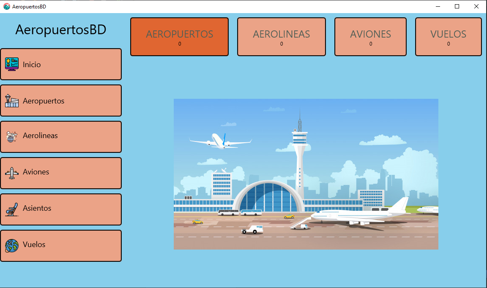

# Proyecto Aeropuerto
### Proyecto para la gestión de un aeropuerto utilizando la ORM Hibernate

### PreRequisitos
* Lanzar USBWebServer. 
  > **User:** root | **Password:** usbw
* Cargar los componentes incluidos jphoenix y componenteAeropuerto

### Contenido Extra
* La carpeta ComponenteAeropuerto contiene el código fuente del bean, que se corresponde con los mapeos y los objetos del proyecto.
